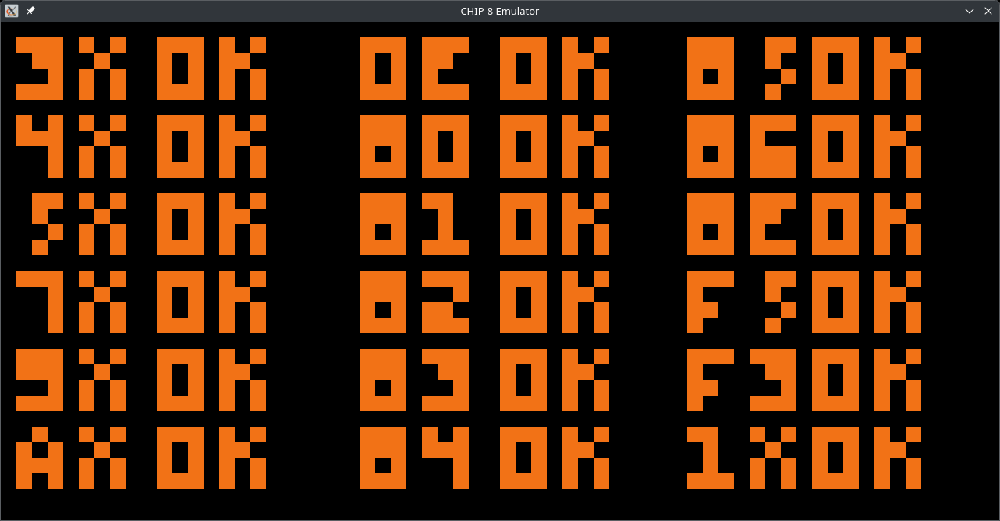
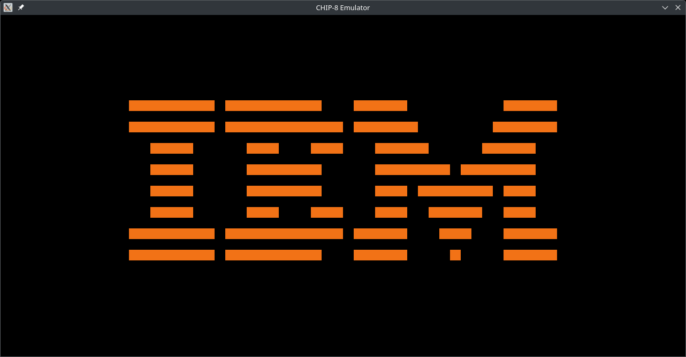

# CHIP-8 Emulator in C

[](https://opensource.org/licenses/MIT)

A CHIP-8 emulator written in C using SDL2 for graphics and input.




> [CHIP-8](https://en.wikipedia.org/wiki/CHIP-8) is an interpreted programming language from the 1970s used to create simple games and programs for vintage computers. Modern implementations emulate the original CHIP-8 virtual machine to run these classic programs.

### [Read about CHIP-8](https://tobiasvl.github.io/blog/write-a-chip-8-emulator/) | [CHIP-8 Community Discussion](https://www.reddit.com/r/EmuDev/comments/6lgzzd/what_is_chip8_and_why_does_everyone_want_to/)

## Table of Contents

- [Features](#features)
- [Requirements](#requirements)
- [Installation](#installation)
  - [Linux](#linux)
  - [Arch Linux](#arch-linux)
  - [macOS](#macos)
  - [Windows](#windows)
- [Usage](#usage)
  - [Controls](#controls)
  - [Configuration](#configuration)
- [Technical Details](#technical-details)
- [Testing](#testing)
- [Acknowledgements](#acknowledgements)
- [License](#license)

## Features

- Full CHIP-8 instruction set implementation
- Accurate timing (60Hz for timers, configurable CPU speed)
- Pixel-perfect display rendering
- Sound support
- Configurable display scaling and colors
- Debug mode with instruction logging
- Cross-platform (Linux, macOS, Windows)

## Requirements

- C compiler (GCC, Clang, or MSVC)
- SDL2 library
- CHIP-8 ROM files (`.ch8` extension)

## Installation

### Linux (Debian/Ubuntu)

```bash
# Install dependencies
sudo apt-get install build-essential libsdl2-dev

# Compile
gcc chip8.c -o chip8 -lSDL2
```

### Arch Linux

```bash
# Install dependencies
sudo pacman -S base-devel sdl2

# Compile
gcc chip8.c -o chip8 -lSDL2
```

### macOS

```bash
# Install dependencies
brew install sdl2

# Compile
gcc chip8.c -o chip8 -lSDL2
```

### Windows

1. Install [SDL2](https://www.libsdl.org/download-2.0.php)
2. Compile with:
```bash
gcc chip8.c -o chip8.exe -Ipath/to/SDL2/include -Lpath/to/SDL2/lib -lSDL2main -lSDL2
```

## Usage

Run the emulator with a ROM file:
```bash
./chip8 roms/PONG
```

### Controls

CHIP-8 keypad mapped to your keyboard:

```
CHIP-8   Keyboard
1 2 3 C  1 2 3 4
4 5 6 D  Q W E R
7 8 9 E  A S D F
A 0 B F  Z X C V
```

- **ESC**: Quit emulator
- **SPACE**: Pause/Resume

### Configuration

Modify the source code to change these settings:

- Display scaling (`SCALE_FACTOR`)
- Emulation speed (`IPS` - instructions per second)
- Colors (`fg_color`, `bg_color`)
- Pixel outline (`outline`)

## Technical Details

This emulator implements:

- Full CHIP-8 instruction set (35 opcodes)
- 4KB memory with program space starting at 0x200
- 16 general-purpose 8-bit registers (V0-VF)
- 16-bit index register (I) and program counter (PC)
- 60Hz delay and sound timers
- 64x32 pixel monochrome display
- Hex-based keypad input

The emulator uses SDL2 for:
- Window management
- Pixel rendering
- Keyboard input
- Basic sound output

## Testing

The emulator has been tested with these ROMs:
- PONG
- TETRIS
- BRIX
- MAZE
- INVADERS

To enable debug logging, compile with:
```bash
gcc -DDEBUG chip8.c -o chip8 -lSDL2
```

## Acknowledgements

- [Cowgod's CHIP-8 Technical Reference](http://devernay.free.fr/hacks/chip8/C8TECH10.HTM)
- [How to write an emulator (CHIP-8 interpreter)](https://tobiasvl.github.io/blog/write-a-chip-8-emulator/)
- [SDL2 documentation](https://wiki.libsdl.org/SDL2/FrontPage)

## License

This project is open source and available under the [MIT License](LICENSE).